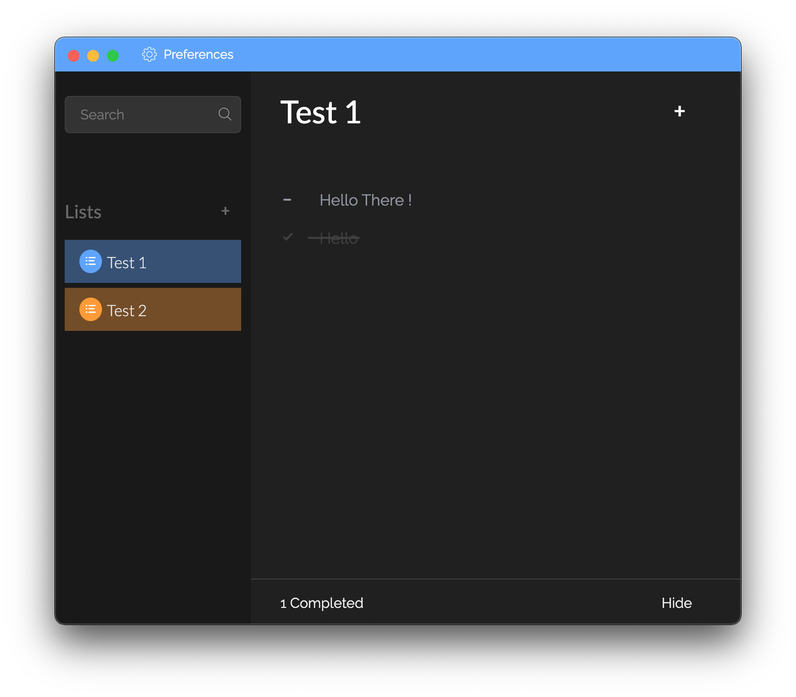
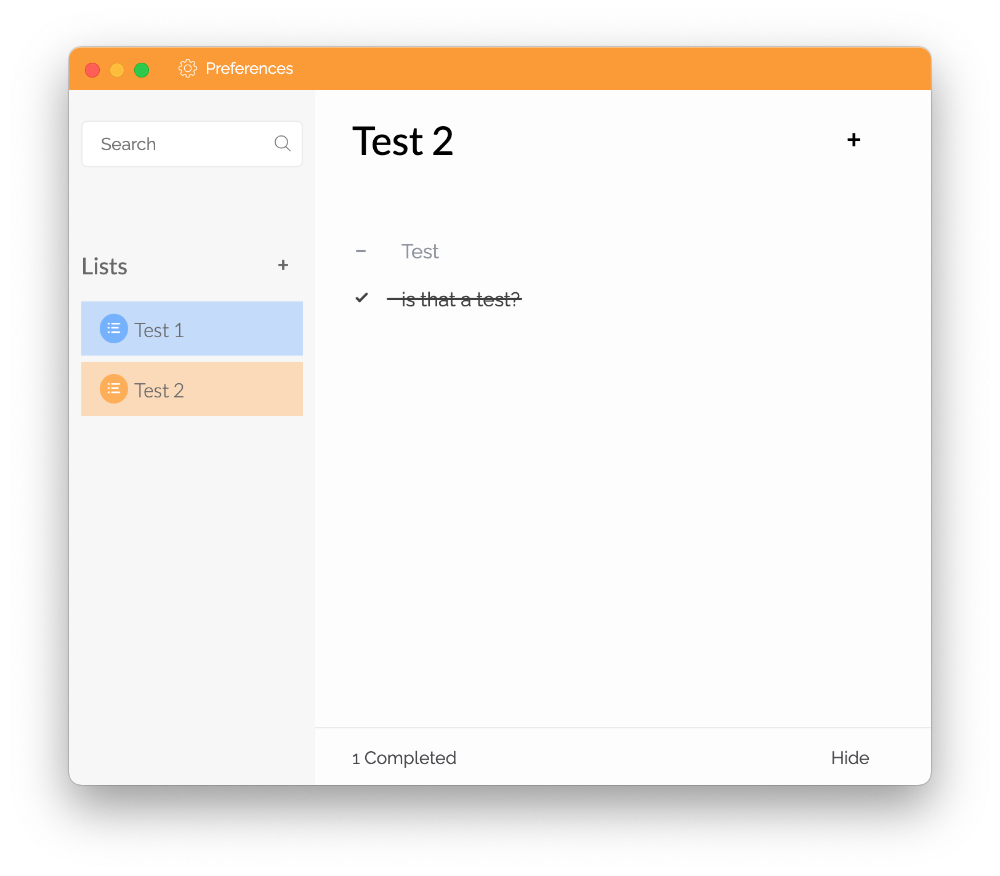

# Todoiva 
![Version][version-image]
[![Türkçe readme.md][readme-image]](readme_tr.md)
[![codecov][codecov-image]][codecov-url]
[![CodeFactor][CodeFactor-image]][CodeFactor-url]
[![CodeQL][codeql-image]][codeql-url]
[![License][license-badge]][license-url]
> Your loyal, stylish to-do assistant

Todoiva is a stylish non-competitive electron app. Todoiva developing for developers to learn coding as pratically as they could learn. 

---

## Screenshoots

## Roadmap

- [x] Improved new design.

- [x] New database system integrated.

- [x] Language system integrated.

- [ ] Animations added.

- [ ] To-Do Lists can be created.

- [ ] To-Do items will be completed instead of being completely deleted, and the desired deletion will be deleted.

- [ ] Minor features have been added to make the interface easier to use.

## Contributors

Contributors Image created by [contributors-img](https://contrib.rocks)

[readme-image]: https://img.shields.io/badge/Türkçe%20için%20Tıkla-red
[version-image]: https://badgen.net/badge/version/v1.3/green?icon=github

[license-badge]: https://badgen.net/github/license/merchizm/todoiva
[license-url]: https://github.com/merchizm/todoiva/LICENSE

[travis-image]: https://travis-ci.org/merchizm/todoiva.svg?branch=master
[travis-url]: https://travis-ci.org/merchizm/todoiva

[github-tag-image]: https://img.shields.io/github/tag/merchizm/todoiva.svg
[github-tag-url]: https://github.com/merchizm/todoiva/releases/latest

[codecov-image]: https://codecov.io/gh/merchizm/todoiva/branch/new-version/graph/badge.svg
[codecov-url]: https://codecov.io/gh/merchizm/todoiva

[CodeFactor-image]: https://www.codefactor.io/repository/github/merchizm/todoiva/badge
[CodeFactor-url]: https://www.codefactor.io/repository/github/merchizm/todoiva

[codeql-image]: https://github.com/merchizm/todoiva/actions/workflows/codeql-analysis.yml/badge.svg?branch=new-version
[codeql-url]: https://github.com/merchizm/todoiva/actions/workflows/codeql-analysis.yml